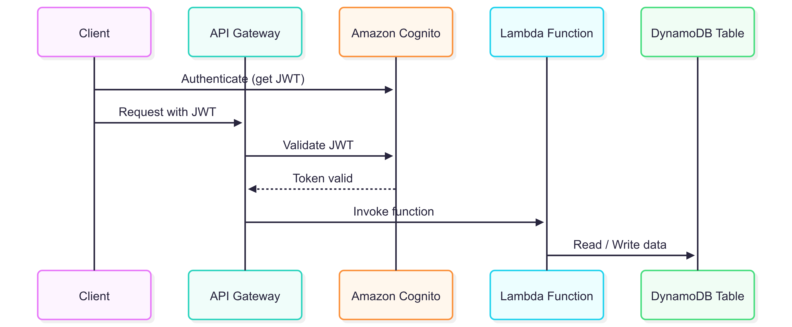

# 🛒 Serverless Shopping List API

> **A secure, serverless API for managing shopping lists and products, built with AWS Lambda (Python 3.13), API Gateway, IAM, and DynamoDB single-table design.**  
> Supports fine-grained IAM, JWT-based Cognito User Pool Authorizer (built-in in API Gateway), and flexible list/product management.

> ⚠️ No frontend code included.  
> ✅ Tested manually using Postman by adding a valid Cognito access token in the `Authorization` header.


---

## 📋 Table of Contents

- [Purpose and Scope](#purpose-and-scope)
- [Core Technologies](#core-technologies)
- [Architecture](#architecture)
- [DynamoDB Design](#dynamodb-design)
- [Attribute Definitions](#attribute-definitions)
- [API Endpoints](#api-endpoints)
- [Example Records](#example-records)
- [API Security](#api-security)
- [Environment Configuration](#️environment-configuration)
- [Data Flow Example](#data-flow-example)


---

## Purpose and Scope

The **Serverless Shopping List API** allows each user to:
- Manage multiple shopping lists
- Add, update, delete products within lists
- Mark products as purchased/unpurchased
- Access all via secure, stateless, RESTful API

---

## Core Technologies

| Component     | Technology                  | Purpose                                      |
|--------------:|----------------------------:|----------------------------------------------:|
| Compute       | AWS Lambda (Python 3.13)    | Stateless CRUD handlers                      |
| Database      | DynamoDB (single-table)     | NoSQL storage for lists & products           |
| Auth          | Amazon Cognito + IAM        | JWT validation & user management             |
| API           | API Gateway                 | HTTP interface and routing                   |
| Libraries     | boto3                       | AWS SDK for DynamoDB operations              |

---

## Architecture



---

## DynamoDB Design

### Key Schema

| Attribute Name |  Key Type |                                                    Format |                                Description |
| -------------- | --------: | --------------------------------------------------------: | -----------------------------------------: |
| PK             | Partition |                                          `USER#{user_id}` |  Unique user identifier (e.g., `USER#123`) |
| SK             |      Sort | `LIST#{list_id}` or `LIST#{list_id}#PRODUCT#{product_id}` | Identifies a list or product within a list |

**Query flexibility:**

* All lists for a user → SK starts with `LIST#`
* All products in a list → SK starts with `LIST#{list_id}#PRODUCT#`

---

## Attribute Definitions

|     Attribute |    Type |    Applies To | Description                                  |                               Constraints |
| ------------: | ------: | ------------: | -------------------------------------------- | ----------------------------------------: |
|    list\_name |  String |    LIST items | Name of the shopping list                    | Required, non-empty, max length 100 chars |
|   created\_at |  String |    LIST items | ISO 8601 timestamp of list creation          |  Required, format: `YYYY-MM-DDThh:mm:ssZ` |
| product\_name |  String | PRODUCT items | Name of the product                          | Required, non-empty, max length 100 chars |
|      quantity |  Number | PRODUCT items | Quantity to purchase                         |            Required, positive integer ≥ 1 |
|        bought | Boolean | PRODUCT items | If product has been purchased                |                Required, default: `false` |
|     added\_at |  String | PRODUCT items | ISO 8601 timestamp of adding product to list |  Required, format: `YYYY-MM-DDThh:mm:ssZ` |
|      category |  String | PRODUCT items | Optional category for filtering              |             Optional, max length 50 chars |

---

## API Endpoints

|   Resource Group |               Operation | HTTP Method |                                         Endpoint | DynamoDB Operation |                     Notes |
| ---------------: | ----------------------: | ----------: | -----------------------------------------------: | -----------------: | ------------------------: |
|         `/lists` | List all shopping lists |         GET |                                         `/lists` |              Query |     Supports query params |
|          `/list` |    Create shopping list |        POST |                                          `/list` |            PutItem |                           |
|                  |       Get shopping list |         GET |                                `/list/{list_id}` |            GetItem |                           |
|                  |    Update shopping list |         PUT |                                `/list/{list_id}` |         UpdateItem | Partial updates supported |
|                  |    Delete shopping list |      DELETE |                                `/list/{list_id}` |     BatchWriteItem |                           |
| `/list-products` |          Create product |        POST |              `/list-products/{list_id}/products` |            PutItem |                           |
|                  |   List products in list |         GET |              `/list-products/{list_id}/products` |              Query |    Filterable by category |
|                  |     Get product details |         GET | `/list-products/{list_id}/products/{product_id}` |            GetItem |                           |
|                  |          Update product |         PUT | `/list-products/{list_id}/products/{product_id}` |         UpdateItem |                           |
|                  |          Delete product |      DELETE | `/list-products/{list_id}/products/{product_id}` |         DeleteItem |                           |

---

## Example Records

|       PK |                   SK |       list\_name |          created\_at | product\_name | quantity | category | bought |            added\_at |
| -------: | -------------------: | ---------------: | -------------------: | ------------: | -------: | -------: | -----: | -------------------: |
| USER#123 |             LIST#abc | Weekly Groceries | 2025-07-28T10:00:00Z |             - |        - |        - |      - |                    - |
| USER#123 | LIST#abc#PRODUCT#xyz |                - |                    - |          Milk |        2 |    Dairy |  false | 2025-07-28T10:05:00Z |

---

## API Security

- Users authenticate **outside** this project (e.g., Cognito Hosted UI, implicit flow).
- Backend only expects JWT sent by client.
- API Gateway validates JWT against Cognito user pool before calling Lambda.

### Notes
**API Gateway:**

-Validates JWT against Cognito user pool.

Lambda receives event:

-Parses userId from query params.

### Example request

```http
GET /lists
Authorization: Bearer <valid-jwt-token>
X-User-Id: user123
```

---

## Environment Configuration

### Required variables

```yaml
TABLE_NAME: ShoppingList
REGION: us-east-2
```

---

## Data Flow Example

**Scenario:** User wants to see their shopping lists.

1. User logs in via Cognito Hosted UI → gets an `access_token` (JWT).
2. Mobile app calls:
```http
GET /lists?userId=USER#123
Authorization: Bearer <access_token>
```
---

## API testing

[](https://app.getpostman.com/run-collection/45628109-22f4b365-deb5-4630-84ba-f4e6515f79fd?action=collection%2Ffork&source=rip_markdown&collection-url=entityId%3D45628109-22f4b365-deb5-4630-84ba-f4e6515f79fd%26entityType%3Dcollection%26workspaceId%3Dbbf97028-3f6d-4d5f-a074-561043009ac7)
